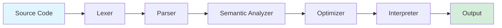

<div align="center">


# 🚀 MiniLang Compiler

### *A Comprehensive Educational Compiler for Learning*

[](https://flutter.dev)
[](https://dart.dev)
[](https://opensource.org/licenses/MIT)
[](http://makeapullrequest.com)

**Build • Learn • Compile**

[Features](#-features) • [Installation](#️-installation) • [Quick Start](#-quick-start) • [Documentation](#-documentation) • [Contributing](#-contributing)

</div>

## 📖 Overview

**MiniLang Compiler** is a feature-rich educational platform that brings compiler theory to life through an interactive Flutter application. Designed for students, educators, and enthusiasts, it provides a complete compiler pipeline with real-time visualization, AI-powered assistance, and an intuitive code editor.

MiniLang is a simple imperative language that supports modern programming concepts like functions, arrays, lambdas, and control flow—perfect for understanding how compilers work under the hood.

<div align="center">

### 🎯 **Why MiniLang?**

| **Interactive Learning** | **Full Pipeline** | **AI Assistant** | **Offline-First** |
|:---:|:---:|:---:|:---:|
| Visualize each compilation phase in real-time | Lexer → Parser → Semantic → Optimizer → Interpreter | Built-in chatbot for instant help | Works without internet connection |

</div>

---

## ✨ Features

### 🔧 **Complete Compiler Pipeline**



- **Lexer**: Tokenizes source code with comprehensive error handling
- **Parser**: Constructs Abstract Syntax Tree using recursive descent
- **Semantic Analyzer**: Type checking, scope validation, symbol table management
- **Optimizer**: Constant folding, dead code elimination, strength reduction
- **Interpreter**: Direct AST execution with runtime environment

### 📝 **Advanced Code Editor**

<table>
<tr>
<td width="50%">

#### Editing Features
- 🎨 **Syntax Highlighting**
  - Keywords, operators, literals
  - Custom color schemes
  - Dark/Light theme support

- ⚡ **Smart Assistance**
  - Auto-completion
  - Bracket matching
  - Code folding
  - Hover tooltips

</td>
<td width="50%">

#### Diagnostics
- 🔍 **Real-time Analysis**
  - Syntax errors
  - Type mismatches
  - Warning messages
  - Quick fixes

- 📊 **Code Metrics**
  - Line numbers
  - Column indicators
  - Character count

</td>
</tr>
</table>

### 🎓 **Interactive Compilation Viewer**

Visualize each phase of compilation with detailed information:

| Phase | Visualization | Details |
|-------|--------------|---------|
| **Lexical Analysis** | Token table with types and positions | All tokens identified with metadata |
| **Syntax Analysis** | Tree structure of AST nodes | Hierarchical code representation |
| **Semantic Analysis** | Symbol table with scopes | Variable/function declarations |
| **Optimization** | Before/after comparison | Applied transformations |
| **Execution** | Step-by-step runtime logs | Variable states and outputs |

### 🤖 **AI-Powered Learning Assistant**

<details>
<summary><b>Technical Query Examples</b></summary>

```
User: "Explain how the parser builds an AST"
AI: Detailed explanation with MiniLang examples

User: "Why am I getting a type error?"
AI: Analyzes code context and suggests fixes

User: "Show me an example of recursion"
AI: Provides fibonacci/factorial examples
```

</details>

**Features:**
- 🧠 Offline ML/NLP engine (no API keys needed)
- 💬 Casual conversation handling with personality
- 🎯 Intent detection and sentiment analysis
- 📚 Contextual memory for follow-up questions
- 🔍 Code debugging assistance

### 📚 **Built-in Example Library**

<div align="center">

| Category | Examples |
|:--------:|:---------|
| 🟢 **Basics** | Hello World, Variables, Math Operations |
| 🔵 **Control Flow** | If-Else, While Loops, For Loops |
| 🟣 **Functions** | Recursion (Fibonacci), Return Values, Parameters |
| 🟡 **Advanced** | Arrays, Lambdas, Nested Scopes |

</div>

One-click loading directly into the editor!

---

## 🛠️ Installation

### Prerequisites

```bash
Flutter SDK: >= 3.10.0
Dart SDK:    >= 3.0.0
```

### Setup Steps

```bash
# 1. Clone the repository
git clone https://github.com/yourusername/minilang-compiler.git
cd minilang-compiler

# 2. Install dependencies
flutter pub get

# 3. Run the application
flutter run

# 4. Build for production (optional)
flutter build apk   # Android
flutter build ios   # iOS
flutter build web   # Web
```

<details>
<summary><b>Platform-Specific Notes</b></summary>

**Android:**
- Minimum SDK: 21 (Android 5.0)
- Target SDK: 34

**iOS:**
- Minimum deployment: iOS 12.0
- Requires Xcode 14+

**Web:**
- Supports all modern browsers
- PWA capabilities included

</details>

---

## 🚀 Quick Start

### Your First Program

1. **Launch the App**
   - Complete the welcome tour on first run
   - Choose your theme (dark/light)

2. **Load an Example**
   ```
   Examples Tab → Select "Fibonacci" → Load
   ```

3. **Write MiniLang Code**
   ```minilang
   func fibonacci(int n) {
       if (n <= 1) {
           return n;
       }
       return fibonacci(n - 1) + fibonacci(n - 2);
   }

   void main() {
       print(fibonacci(10));  // Output: 55
   }
   ```

4. **Compile & Run**
   ```
   Click "Compile" → View phases → Check console output
   ```

5. **Explore AI Assistant**
   ```
   Chatbot Tab → Ask: "How do I define a function?"
   ```

### MiniLang Language Syntax

<details>
<summary><b>Language Reference</b></summary>

**Data Types:**
```minilang
int x = 42;
float pi = 3.14;
string name = "MiniLang";
bool flag = true;
array[int] numbers = [1, 2, 3];
```

**Control Flow:**
```minilang
if (condition) {
    // code
} else {
    // code
}

while (condition) {
    // code
}

for (int i = 0; i < 10; i = i + 1) {
    // code
}
```

**Functions:**
```minilang
func add(int a, int b) {
    return a + b;
}

void greet(string name) {
    print("Hello, " + name);
}
```

**Lambdas:**
```minilang
lambda (int x) { return x * 2; }
```

</details>

---

## 📂 Project Structure

### Core Architecture

**Compiler Pipeline** (`lib/compiler/`)
- `lexer.dart` - Tokenization engine with error handling
- `parser.dart` - Recursive descent parser for AST construction
- `semantic_analyzer.dart` - Type checking and scope validation
- `interpreter.dart` - Runtime execution environment
- `minilang_optimizer.dart` - Code optimization passes

**Data Models** (`lib/models/`)
- Token representations with position tracking
- AST node definitions for all language constructs
- Symbol table for scope management

**State Management** (`lib/providers/`)
- Compiler state and pipeline coordination
- Editor state and document management
- Theme and settings management

**User Interface** (`lib/screens/` & `lib/widgets/`)
- Main editor screen with tabbed compilation viewer
- Welcome tour and onboarding
- AI chatbot interface
- Reusable components (code editor, console, phase viewers)

---

## 🤖 AI Integration

### Offline ML/NLP Engine

The chatbot leverages a custom-built natural language processing system:

```dart
// Technical Query Example
Query: "What's the difference between lexer and parser?"

Response:
┌─────────────────────────────────────────┐
│ Lexer (Lexical Analyzer)              │
│ • Reads source code character by char  │
│ • Groups into tokens (keywords, IDs)   │
│ • Outputs: Token stream                │
│                                         │
│ Parser (Syntax Analyzer)               │
│ • Reads token stream                   │
│ • Checks grammar rules                 │
│ • Outputs: Abstract Syntax Tree        │
│                                         │
│ Think: Lexer = words, Parser = grammar │
└─────────────────────────────────────────┘
```

**Capabilities:**
- 🎯 Intent classification (10+ categories)
- 😊 Sentiment analysis
- 🧠 Contextual memory (5-message history)
- 📖 Knowledge graph with 50+ concepts
- 🔄 Follow-up question handling

### Casual Conversation

```
User: "Hey, what's up?"
AI: "Hello! I'm here to help you learn about compilers and MiniLang. 
     Want to explore some examples or have questions about compilation?"

User: "Thanks!"
AI: "You're welcome! Feel free to ask anything about programming or compilers."
```

---

## 📚 Documentation

### Learning Paths

<table>
<tr>
<td width="33%" align="center">

#### 🌱 **Beginner**
Start with basics
- Variables & Types
- Simple I/O
- Basic control flow

[View Examples →](#)

</td>
<td width="33%" align="center">

#### 🌿 **Intermediate**
Build on foundations
- Functions
- Arrays
- Recursion

[View Examples →](#)

</td>
<td width="33%" align="center">

#### 🌳 **Advanced**
Master concepts
- Lambdas
- Complex algorithms
- Optimization

[View Examples →](#)

</td>
</tr>
</table>

### Compilation Phases Explained

<details>
<summary><b>1. Lexical Analysis (Lexer)</b></summary>

**Purpose:** Break source code into tokens

**Input:** `int x = 42;`

**Output:**
| Token Type | Value | Position |
|------------|-------|----------|
| KEYWORD | int | 0:3 |
| IDENTIFIER | x | 4:5 |
| OPERATOR | = | 6:7 |
| NUMBER | 42 | 8:10 |
| DELIMITER | ; | 10:11 |

</details>

<details>
<summary><b>2. Syntax Analysis (Parser)</b></summary>

**Purpose:** Build Abstract Syntax Tree

**Example AST:**
```
Program
└── VariableDeclaration
    ├── Type: int
    ├── Name: x
    └── Value: NumberLiteral(42)
```

</details>

<details>
<summary><b>3. Semantic Analysis</b></summary>

**Purpose:** Type checking and scope validation

**Checks:**
- Variable declarations before use
- Type compatibility
- Function signatures
- Return type matching

</details>

<details>
<summary><b>4. Optimization</b></summary>

**Techniques:**
- **Constant Folding:** `2 + 3` → `5`
- **Dead Code Elimination:** Remove unreachable code
- **Strength Reduction:** `x * 2` → `x + x`

</details>

<details>
<summary><b>5. Interpretation</b></summary>

**Purpose:** Execute optimized AST

**Features:**
- Call stack management
- Memory allocation
- Runtime error handling

</details>

---

## 🎨 UI/UX Features

### Theme System

<div align="center">

| 🌙 Dark Mode | ☀️ Light Mode |
|:---:|:---:|
| Eye-friendly for night coding | Clear readability in daylight |
| Syntax colors optimized | High contrast text |

</div>

### Localization

- 🇬🇧 English (en)
- 🇮🇷 Persian (fa)

### Accessibility

- ♿ Screen reader support
- ⌨️ Keyboard shortcuts
- 🔠 Adjustable font sizes
- 🎨 High contrast mode

---

## 🔧 Configuration

### Editor Settings

```dart
// Customize in settings
editor:
  fontSize: 14
  tabSize: 4
  lineNumbers: true
  autoComplete: true
  bracketMatching: true
```

### Compiler Options

```dart
compiler:
  optimization: true
  verboseOutput: false
  maxRecursionDepth: 1000
```

---

## 🐛 Troubleshooting

### Common Issues

<details>
<summary><b>Build Errors</b></summary>

```bash
# Clear Flutter cache
flutter clean
flutter pub get

# If still failing, upgrade Flutter
flutter upgrade
```

</details>

<details>
<summary><b>AI Not Responding</b></summary>

1. Check offline mode is enabled in settings
2. Restart the application
3. Clear app cache (Settings → Advanced)

</details>

<details>
<summary><b>Performance Issues</b></summary>

- Disable animations: Settings → Reduce Motion
- Lower syntax highlighting: Settings → Editor → Simple Colors
- Close unused tabs in compilation viewer

**Minimum Requirements:**
- RAM: 2GB
- Storage: 100MB
- Android 5.0+ / iOS 12.0+

</details>

---

## 🤝 Contributing

We welcome contributions from the community! Here's how you can help:

### How to Contribute

```bash
# 1. Fork the repository on GitHub

# 2. Clone your fork
git clone https://github.com/YOUR_USERNAME/minilang-compiler.git

# 3. Create a feature branch
git checkout -b feature/amazing-feature

# 4. Make your changes
# ... code code code ...

# 5. Commit with descriptive message
git commit -m 'Add amazing feature: [description]'

# 6. Push to your fork
git push origin feature/amazing-feature

# 7. Open a Pull Request
```

### Contribution Areas

| Area | Examples |
|------|----------|
| 🌐 **Language Features** | New syntax, operators, data types |
| 🎨 **UI/UX** | Theme improvements, new widgets |
| 🤖 **AI** | More training data, better responses |
| 📚 **Examples** | Complex algorithms, tutorials |
| 🧪 **Testing** | Unit tests, integration tests |
| 📖 **Documentation** | Guides, API docs, translations |

### Code Standards

- Follow [Effective Dart](https://dart.dev/guides/language/effective-dart) guidelines
- Add tests for new features
- Update documentation
- Keep PRs focused and small

---

## 📄 License

This project is licensed under the **MIT License**. See the [LICENSE](LICENSE) file for details.

---

## 🙏 Acknowledgments

<div align="center">

### Special Thanks To

**Flutter Team** | **Dart Community** | **Open Source Contributors**
:---: | :---: | :---:
Amazing cross-platform framework | Robust language and tooling | Provider, SharedPreferences, and more

---

### Built With

[](https://flutter.dev)
[](https://dart.dev)
[](https://pub.dev/packages/provider)

---

</div>

---

<div align="center">


### ✨ **Built with ❤️ for compiler enthusiasts** ✨

[](https://github.com/Na7iD)

</div>
